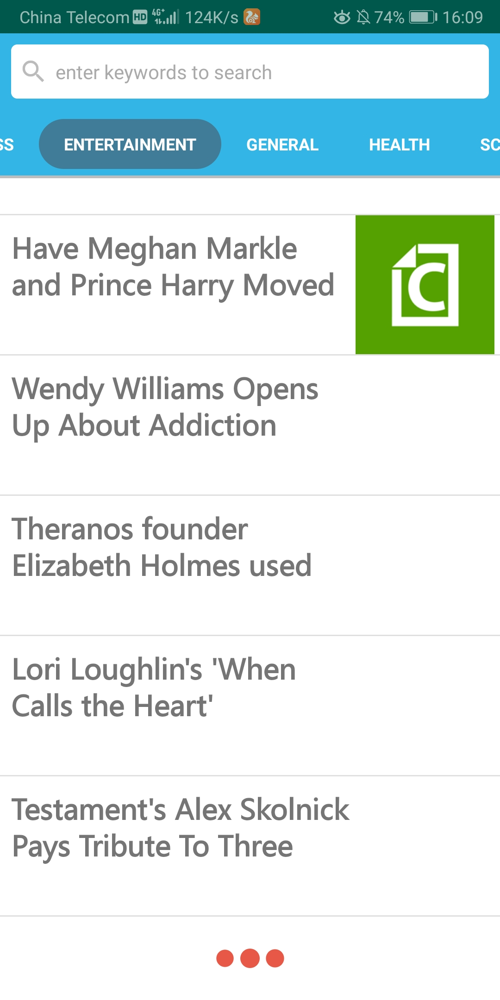
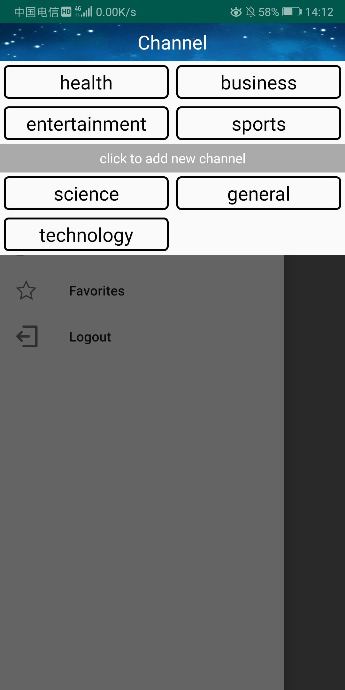

# HappyNews
##Product Guideline
###1. Installation
####Click the apk file to install the application

###2. Register
1. The first time you open the app, you can see the login interface as below.

2. Click the text ¡°Don¡¯t have an account? Register now!¡± to open the register interface.

3. Fill in the information that asked, and click register button to create a new account.

###3. Login
1. After registration, it will automatically jump back to the login interface, and the Email and password will be filled in automatically.

2. The default setting is to remember the users¡¯ email and password, so if you don¡¯t want it to remember that, just click it.

###4. Functions
####1. Read different types of news
After login, it will show you the main interface as below.

#####1. Slide to change news channel
You can slide from left to right or right to left to change the news channel.

#####2. Slide from top to bottom to refresh news list

#####3. Slide from bottom to top to load more news

#####4. Search news
Click the search bar and input the key words to search the news that you like.

#####5. Read News
Click one of the news to start reading.

####2. Choose your favorite types of news
1. Slide from the left edge of the screen to open the navigation interface.

2. Click the ¡°Channel Management¡± to open the channel dialog, and choose your favorite channels. And you need to restart the app to confirm changes.

####3. Collect your favorite news
1. If you like one of the news and wanted to read it later, you can click the star in the top right corner.

2. Then, open the navigation interface, click ¡°Favorites¡± to open the favorites interface

